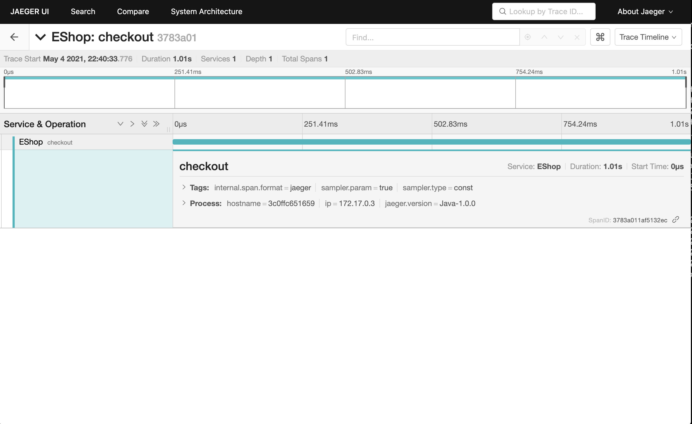

# EShop demo application

## How to build source code?

```bash
make
```

## How to run this demo?

### Start a Jaeger all-in-one sever for test

```bash
docker run -d --name jaeger \
  -p 14268:14268 \
  -p 16686:16686 \
  jaegertracing/all-in-one:1.39
```

### Start the demo application
```bash
docker run -d --name demo \
  -p 80:8080 \
  skyglass/tracing-online:latest
```

## Test the demo

Use curl command or open url ```127.0.0.1/checkout``` in the browser. You should be able to see output as the followings.

```bash
➜  milestone1 git:(master) ✗ curl 127.0.0.1/checkout
You have successfully checked out your shopping cart.
```

## Check the generated trace and span at the Jaeger UI

Open URL ```http://127.0.0.1:16686/``` in the browser. You should be able to see the generated traces in the Jaeger UI.



Like this diagram shows, the trace seems pretty simple, with only one span in it. However, it already gives us some useful information such as
how long does the checkout operation took. In the next project, we are going to expand the trace to multiple spans.
